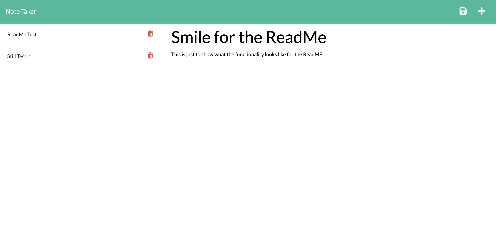

# Hittin' The Note

Hittin' The Note is a note taking application named after an Allman Brothers Band record. 

It looks like this:

## What does it do?
Hittin' The Note allows for you to save, recall, and delete notes.

## Tech stack
This application is built with html, bootstrap css, javascript, jquery, node.js, and express js. 

## Give it a whirl!

You can check out the app at https://hittin-the-note.herokuapp.com/

Hittin the Note was made by [Dan Evola](https://dmevola.github.io/portfolio)